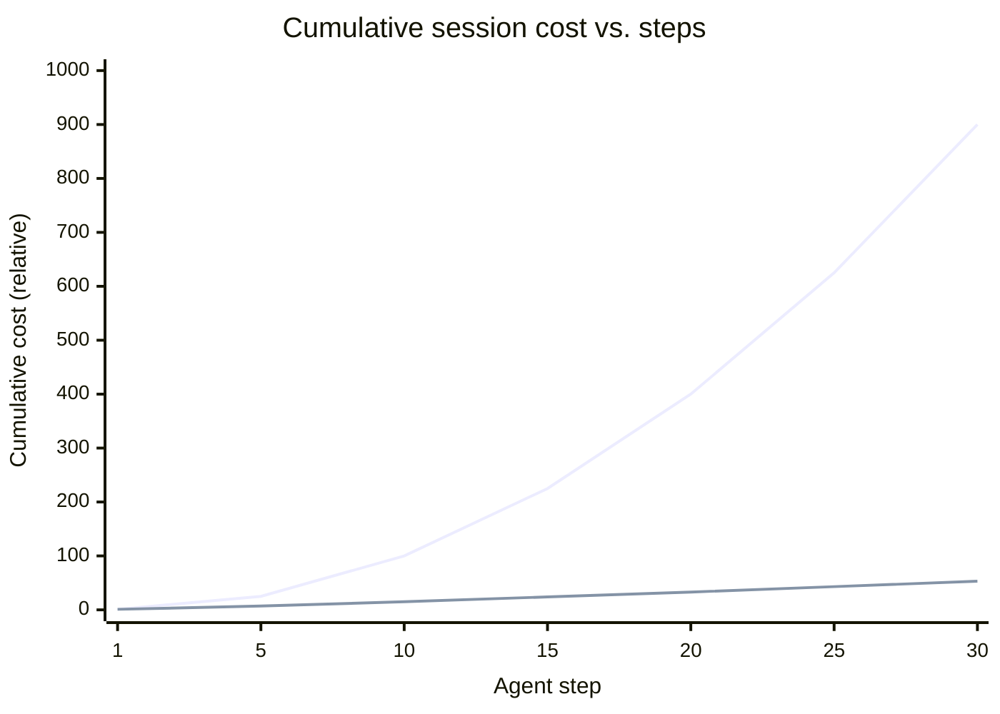
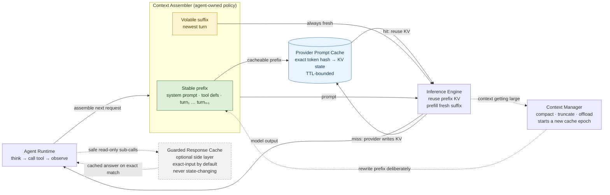

# How Caching Works for AI Inference (and Why It Slashes Agentic Costs)

Agentic engineering has a dirty secret: most of the tokens you pay for are the *same tokens, over and over*. Every step an agent takes replays the system prompt, the tool definitions, and the entire conversation so far. Caching is what turns that redundancy from a cost into a rebate.

This article explains the two layers of caching that matter — the hardware-level KV cache and the API-level prompt cache — how to exploit them to cut agentic inference costs by up to ~90%, and closes with a full worked answer to a common system-design interview question about it.

---

## Part 1: The Mechanism — Why Inference Repeats Work

### Transformers are stateless

A large language model doesn't "remember" your conversation. Every API call re-sends the full context (system prompt + tools + all prior turns), and the model reprocesses that context from scratch to produce the next token.

Internally, generating text has two phases:

1. **Prefill** — the model reads the entire prompt in one pass and computes intermediate attention state for every token. This is compute-bound and scales with prompt length.
2. **Decode** — the model emits output tokens one at a time, each attending back over the whole prompt.

The expensive part for long prompts is prefill. And in an agent loop, the prompt is *mostly identical* every single step.

### Weights vs. activations (the distinction the cache turns on)

Before the cache makes sense, it's worth being precise about two very different kinds of numbers inside a model.

**Weights (parameters)** are what training produces. They're fixed after training, identical for every request, and always resident in the model. Self-attention has a set of them that matters here: three learned projection matrices, **W_Q**, **W_K**, and **W_V**. For each token's embedding `x`, the model computes its Query, Key, and Value by projecting through these matrices — `Q = x·W_Q`, `K = x·W_K`, `V = x·W_V`.

A few things about these matrices:

- **They're only a slice of the total parameters.** Each transformer layer also has an attention output projection (W_O) and a feed-forward network — the FFN is usually the *larger* share of a layer's weights. Add embeddings and layer-norm scales, and W_Q/W_K/W_V are just the attention-input projections, not "the model's weights" wholesale.
- **They're per-layer and per-head.** Every layer has its own W_Q/W_K/W_V, split across attention heads within the layer. A 32-layer model has 32 independent sets.
- **They never change at inference.** Same input token, same position → same projection → same output, every single time. That determinism is the whole reason caching can be *exact* rather than approximate.

**Activations** are what those weights produce when they run on a specific input. The Q, K, and V *vectors* are activations: computed fresh from each token, different for every prompt. They're the per-token product, not part of the model.

This is the line the KV cache draws:

| | What it is | Varies per request? | Cached? |
|---|---|---|---|
| **W_Q / W_K / W_V** | Weights (parameters) | No — fixed after training | No — always resident in the model |
| **K / V vectors** | Activations (outputs) | Yes — computed per token | **Yes — this is what the cache stores** |

The weights are the reusable machine; the K/V vectors are what the machine stamps out for each token. The cache saves you from re-stamping the same tokens — it stores the *outputs* of the projection, never the projection matrices themselves.

### The KV cache (what runs under the hood)

Self-attention works by having every token compare itself against every previous token, using the Query, Key, and Value vectors introduced above: a token's output is a weighted sum of the Values of all prior tokens, weighted by how well its Query matches each of their Keys.

The crucial property: a token's Key and Value depend only on that token and the tokens *before* it — never on tokens that come after. So once token *i*'s K and V are computed, they never change, no matter what gets appended later. That's what makes them cacheable.

The **KV cache** stores these Key/Value vectors so the model doesn't recompute them for tokens it has already processed. Within a single generation this is what makes decode fast: to emit token *n+1* you only compute the Q/K/V for the one new token and attend against the cached K/V of the previous *n*, instead of redoing all *n* from scratch. Without it, generating a sequence would be O(n²) in compute per token; with it, each new token is O(n).

The insight behind cross-request **prompt caching** is a natural extension: if two separate requests share the same *prefix* of tokens, that prefix produces byte-identical K/V vectors both times (the computation is deterministic given the same weights and inputs). So instead of throwing the KV cache away when a request finishes, the provider persists it, keyed by a hash of the prefix tokens. The next request that starts with the same tokens skips prefill for the shared portion entirely and pays only to process the new suffix.

Three consequences fall out of this — and they explain every rule you'll see later:

- **Caching only works on a *contiguous prefix*.** Because token *i*'s K/V depends on everything before it, changing a single token at position *k* changes the K/V of every token from *k* onward. So a cache hit is all-or-nothing up to the first difference: everything before the first changed token is reusable; everything after must be recomputed.
- **Order is everything.** Put stable content (system prompt, tool definitions) first and volatile content (the newest turn) last. Anything volatile placed early invalidates the entire tail behind it.
- **The cache key is *lexical*, not *semantic*.** It's a hash of the actual token IDs, not the meaning. Two prompts that mean the same thing but are worded differently share no prefix and get no hit. (Remember this — it's the crux of the interview question below.)

---

## Part 2: Prompt Caching in Practice

Both major providers expose prefix caching, but with different ergonomics.

### Anthropic (Claude)

Claude uses **explicit cache breakpoints**. You mark a content block with `cache_control`, and everything up to that point becomes a cacheable prefix.

**Pricing** (multipliers relative to base input token price):

| Operation | Multiplier | What it means |
|-----------|-----------|---------------|
| Cache write (5-min TTL) | **1.25×** | 25% premium the first time you write |
| Cache write (1-hour TTL) | **2×** | For long-running agent tasks |
| Cache read | **0.1×** | **90% discount** on every hit |

For Claude Opus 4.8 at $5/MTok base input, a cache read costs just **$0.50/MTok**.

**Key details:**

- **Minimum cacheable prefix**: 1,024 tokens for Opus 4.8 / Sonnet 5 / Sonnet 4.6 (varies by model — some smaller models require 2,048 or 4,096). Below the threshold, `cache_control` is silently ignored.
- **TTL**: 5 minutes by default, refreshed on every hit. A `"ttl": "1h"` option exists for tasks that pause longer than 5 minutes between calls.
- **Cache prefix hierarchy**: `tools → system → messages`. Modifying any level invalidates it *and everything after it*.
- **Up to 4 breakpoints** per request, so you can cache sections that change at different rates.
- **20-block lookback**: the system searches back up to 20 content blocks to find a matching cached prefix.

The API response reports, per request, how many tokens were written to the cache versus served from it — so you can watch your hit rate directly. In a healthy agent run the reads should dwarf the writes.

### OpenAI

OpenAI caches **automatically** — no code changes required — for `gpt-4o` and newer, including the GPT-5 family.

- **Automatic**: requests are routed by prompt prefix hash (~first 256 tokens) to a machine that recently saw that prefix.
- **Minimum**: caching activates at **1,024 tokens or more**.
- **Discount**: cached input tokens are billed at a reduced "cached input" rate.
- **Cache writes**: free on pre-GPT-5.6 models; **1.25×** on GPT-5.6 and later.
- **TTL**: ~5–10 minutes typically for older models (up to 1 hour); GPT-5.6+ guarantees a **30-minute** minimum retention.

The tradeoff: OpenAI is zero-effort but gives you less control; Anthropic requires explicit breakpoints but lets you tune exactly what gets cached and for how long.

---

## Part 3: Why This Is Huge for Agentic Engineering

Agents are the *ideal* caching workload because they are structurally repetitive.

### The agent loop replays everything

A typical agent step sends:

```
[ system prompt ]        ← stable, large (instructions, persona, rules)
[ tool definitions ]     ← stable, often large (many tools with schemas)
[ conversation so far ]  ← grows every step, but the prefix is stable
[ newest observation ]   ← the only genuinely new content
```

On step 10, the first three sections are nearly identical to step 9. Without caching you pay full price to reprocess a 50K-token context ten times. With caching, you pay the write cost once and then 10% for every subsequent step.

### The math

Take a 100,000-token context (large system prompt + tools + document) queried repeatedly, with Claude Opus 4.8 at $5/MTok:

| Scenario | First call | Each repeat call |
|----------|-----------|------------------|
| No caching | $0.50 | $0.50 |
| 5-min cache | $0.625 (write @ 1.25×) | **$0.05** (read @ 0.1×) |

That's a **~90% reduction** on every step after the first. Over a 20-step agent run, the cached version costs roughly `$0.625 + 19×$0.05 = $1.58` versus `20×$0.50 = $10.00` uncached.

### Secondary wins

- **Latency**: skipping prefill on cached tokens makes each agent step noticeably faster — often the bigger felt improvement in interactive tools.
- **Rate limits**: cache reads don't count against input-token rate limits (Anthropic), so you can run more concurrent agents.

---

## Part 4: Practical Playbook

1. **Structure prompts stable-first, volatile-last.** System prompt and tool definitions at the top, the newest turn at the bottom. Never put a timestamp or request ID early in the prompt — it poisons the entire prefix.

2. **Cache your tool definitions.** In agentic systems the tool schema is large and rarely changes. On Claude, put a breakpoint on the last tool. A single tool edit invalidates the whole tool + system + message cache, so keep the tool set stable.

3. **Match TTL to your loop cadence.** If agent steps happen within seconds, the default 5-minute TTL (1.25× write) is right. If steps involve minute-long tool calls (builds, human approval), the 1-hour TTL (2× write) pays for itself.

4. **Pre-warm hot prompts.** Write the cache before the user's first real request lands, so the first interaction doesn't eat the prefill latency.

5. **Cache layered content at different granularities.** The system prompt (never changes), the tool set (rarely changes), and per-session retrieved context (stable within a session) each change at a different rate. Caching them as separate segments means a change to one doesn't invalidate the others.

6. **Measure the read/write ratio.** A healthy agent run should be dominated by cache *reads*. A surge in cache *writes* means something volatile is leaking into your prefix and silently breaking the chain — hunt it down.

### Common pitfall: the poisoned prefix

The single most common way teams lose their cache is placing volatile content early. A timestamp, a random request ID, a per-call session token, or a freshly reordered tool list near the top of the prompt changes the prefix hash on *every* request — so nothing after it ever hits. The fix is always the same: pull volatile content to the *end*, and let the stable prefix stay byte-identical across calls.

---

## Part 5: Designing a Cache for a Long-Running Agent

Here's a failure mode every team hits once their agents move past demos: **cost climbs the longer a session runs.** A conversation that costs cents in its first few turns is burning real money by turn fifty, and nobody quite planned for it. It's worth walking through *why* that happens and what the caching layer should actually look like — because the intuitive design is the wrong one.

### What we're actually building (and what we're not)

First, scope. The prefix/KV cache itself is **provider-native** — Anthropic and OpenAI already store the KV state, hash incoming prompts to find matches, and serve hits at the discounted rate. That black box lives inside their inference servers; you can't build it and don't need to.

What we're designing is the **agent-side layer that sits on top of the API and makes the provider's cache actually hit.** It's a two-layer system: the provider supplies the *mechanism*, and this design supplies the *policy* that decides whether the mechanism ever pays off. Left alone, the provider's cache mostly misses — one poisoned prefix (a timestamp up top, a reshuffled tool list) and you pay full price every step even though caching is "on."

Concretely, this design achieves three things:

- **Knocks down the dominant cost.** The headline win is not magic asymptotics by itself: cached tokens are still billed on repeat calls. But the expensive repeated prefix is now charged at a steep discount, and with periodic compaction the long-run curve can stay much closer to linear than quadratic.
- **Directly addresses "cost grows as sessions go on."** Two levers do it: prefix discipline (keeps the cache hitting as history grows) and TTL matched to loop cadence (keeps a slow session from losing the cache and paying full rebuild price).
- **Bounds the underlying growth the cache would otherwise hide.** Caching makes each step cheap but doesn't stop history from growing forever; a context-management step caps it before it blows the context window.

The rest of this section works up to that design from first principles — starting with the design most people reach for, and why it disappoints.

### The intuitive design, and why it disappoints

The reflex is to build a **response cache**: hash the prompt, store the model's answer, and serve it back when the same prompt shows up. Classic memoization. For a stateless Q&A endpoint it's perfect.

For an agent it quietly does nothing, for three reasons:

- **It targets the wrong cost.** Cost isn't climbing because the agent keeps asking the same question — it's climbing because every step re-sends and *reprocesses an ever-longer context*. A response cache stores the cheap thing (the final answer) and ignores the expensive thing (reprocessing the prefix).
- **Agent steps are never byte-identical.** Each step appends a fresh tool result or observation, so the full prompt differs every time. A key over the whole prompt essentially never hits.
- **The "fix" is worse than the problem.** To rescue the hit rate you'd reach for *semantic* matching — "same question, different wording, same answer." But handing an agent a stale near-match can send it down a wrong branch and corrupt the rest of the session. In an agent loop, correctness beats hit rate every time.

### Follow the cost curve

An agent runs a loop — `think → call tool → observe → think → …` — and each iteration sends the whole context back to the model:

```
system prompt + tool definitions + turn₁ + turn₂ + … + turnₙ
```

History is **append-only**: step *n* is everything from step *n−1* plus one new turn. So per-step input cost grows *linearly* with the number of steps, and the session total — the sum of all those steps — grows *quadratically*, O(n²). That quadratic is the whole problem. Any design that doesn't bend that curve is decoration.

### What's actually redundant

Line up two consecutive steps and the context is nearly identical: system prompt, tool definitions, and every prior turn are byte-for-byte the same. The only new tokens are the latest turn, appended at the end. So the expensive redundant work is **re-running prefill over the shared prefix on every step** — not re-answering identical questions. That's what the cache should eliminate.

### The design that bends the curve: cache the prefix, not the answer

Instead of caching final answers keyed by prompt *meaning*, use the provider's prefix cache: the model's intermediate attention state (the KV cache) for the shared *prefix*, keyed by an exact token hash:

- **Key** = a hash of the token prefix, computed incrementally per segment — the exact token sequence, not its meaning. Deterministic and exact, so there's no risk of a "close enough" wrong hit.
- **Value** = the KV vectors already computed for that prefix, stored inside the provider's inference layer.
- On every step, the whole prefix (everything but the newest turn) is a hit; you only pay to prefill the new suffix.

The payoff: you pay full price for a token when it first enters the context, then a steep discount (~10% on Claude, a reduced cached-input rate on OpenAI) on later calls that reuse it. If history grows forever, the bill still has a quadratic shape with a much smaller constant; once you add compaction or sliding windows, the practical curve gets much closer to linear. In practice this is provider-native — Anthropic's prompt caching and OpenAI's automatic caching are exactly this mechanism — so the real engineering isn't building the KV store, it's designing the system so the cache keeps hitting.

Plotting cumulative session cost against step count makes the difference obvious — the uncached curve bends upward fast, while caching plus periodic context management keeps the practical curve much flatter:



<details>
<summary>Same chart as an ASCII sketch (for renderers without Mermaid support)</summary>

```
 cost
  ▲
  │                                          ● uncached  (O(n²))
  │                                     ●
  │                                ●
  │                           ●
  │                      ●
  │                 ●
  │            ●
  │       ●
    │   ●                                      ○ cached + compacted
  │ ●                            ○   ○   ○
  │●              ○   ○   ○
  │●  ○   ○   ○
  └●──────────────────────────────────────────▶  steps
   1   5    10    15    20    25    30
```

(The uncached total climbs quadratically because each step reprocesses a longer prefix. Prefix caching discounts that repeated work; compaction is what keeps the prefix from growing without bound.)

</details>

### High-level design



<details>
<summary>Same diagram in plain ASCII (for renderers without Mermaid support)</summary>

```
┌──────────────────┐
│ Agent Runtime    │
│ think / tools /  │
│ observe          │
└────────┬─────────┘
         │ assemble next request
         ▼
┌──────────────────────────────────────────────────┐
│ Context Assembler                                │
│                                                  │
│  Stable prefix: system · tools · prior turns     │
│  Volatile suffix: newest turn                    │
└────────┬───────────────────────────────┬─────────┘
         │ cacheable prefix              │ fresh suffix
         ▼                               ▼
┌──────────────────────┐        ┌──────────────────────────┐
│ Provider Prompt      │ hit →  │ Inference Engine         │
│ Cache                │ ─────▶ │ reuse prefix KV          │
│ exact token hash → KV│ ◀───── │ prefill fresh suffix     │
└──────────────────────┘ miss   └────────────┬─────────────┘
                              provider writes│
                                             │ model output
                                             ▼
                                      ┌──────────────┐
                                      │ Agent Runtime│
                                      └──────┬───────┘
                                             │ safe read-only sub-calls
                                             ▼
                                      ┌──────────────────────┐
                                      │ Guarded Response     │
                                      │ Cache                │
                                      │ exact-input default  │
                                      └──────────────────────┘

When context gets large:

┌──────────────────────┐       rewrite prefix deliberately       ┌──────────────────────┐
│ Context Manager      │ ──────────────────────────────────────▶ │ Context Assembler    │
│ compact / truncate / │                                        │ new cache epoch      │
│ offload              │                                        └──────────────────────┘
└──────────────────────┘
```

</details>

Read the diagram as one request flowing left to right. The **Agent Runtime** is still doing the normal loop — think, call a tool, observe, ask the model again — but before each model call it hands the conversation to the **Context Assembler**. That assembler has one job: keep the request in a cache-friendly shape. Stable content goes into the prefix, and the newest observation stays in the volatile suffix.

From there, the **Inference Engine** receives the full prompt. The suffix is always fresh work, but the prefix can be matched against the **Provider Prompt Cache** by exact token hash. On a hit, the provider reuses the cached KV state for the prefix and only pre-fills the new suffix. On a miss, the provider computes the prefix and writes the resulting KV state back into its own cache. The agent does not store KV vectors itself; it earns hits by making the prefix byte-identical across calls.

The two side paths are deliberately outside the hot path. The **Context Manager** runs when the conversation gets too large: it compacts, truncates, or offloads old context, knowing that this starts a new cache epoch. The **Guarded Response Cache** is even narrower: it is only for safe, read-only sub-calls where replaying an exact prior answer is acceptable. It should never be the main mechanism for the agent loop.

The load-bearing idea is the **prefix/suffix split**. The assembler is built to keep the stable prefix immutable and push everything volatile into the suffix. The prompt cache is provider-owned; the agent owns the ordering, breakpoints, TTL choice, and telemetry that make it hit. The response cache is separate, optional, and guarded — the intuitive design isn't worthless; it's just demoted to the one place it's safe.

### Keeping the cache hitting

A prefix cache you feed carelessly gives you nothing, so most of the real work lives in the Context Assembler:

- **Stable ordering.** Stable content first (system prompt, tools), volatile last (latest observation). A timestamp, random ID, or reshuffled tool list near the top rewrites the prefix hash on every request and silently drops the hit rate to zero — no error, just a bigger bill.
- **Append within a cache epoch; rewrite only deliberately.** Treat already-cached history as immutable. Editing or reordering a past turn invalidates everything after the edit; if you must redact, summarize, or normalize old context, do it as an explicit new epoch.
- **TTL matched to loop cadence.** Sub-second loops are fine on a short TTL; loops with slow tool calls — builds, retrieval, human approval — need a longer TTL so the prefix survives the gap between steps. This is the direct lever on "cost grows as sessions go on": a session that stalls past its TTL loses the cache and pays full price to rebuild it.

### Bounding the growth itself

Prefix caching makes each step cheap, but the context still grows without limit — per-step cost keeps creeping up and you'll eventually hit the context window. That's the Context Manager's job:

- **Compaction / summarization.** Periodically fold a long run of old turns into a compact summary. This shrinks the prefix but invalidates the cache from the summary point onward — so it runs on a cadence, in bursts, not every step. Think of each compaction as starting a new cache epoch.
- **Truncation / sliding window.** Drop turns that no longer matter, or move large tool outputs into a scratchpad and keep only a reference.
- **Externalize large artifacts.** Don't carry a 50 KB file dump inline for thirty steps; store it and re-fetch on demand.

The tension is the interesting part: **caching and compaction pull against each other** — compaction breaks the cache to shrink the prefix. The design answer is rhythm, not either/or: let the cache run between compactions, and compact only when the prefix has grown enough to justify the reset.

### Where the response cache still earns its place

The memoization instinct isn't wrong, just misplaced. As the separate outer layer in the diagram, a response cache genuinely helps for **idempotent, read-only sub-calls** — "summarize this document," "classify this text" — where the model, prompt, decoding settings, and input are pinned tightly enough that replaying a prior answer is acceptable. Prefer exact-input keys by default; reserve semantic matching for narrow, audited cases where a stale near-match cannot corrupt the agent's next step. Prefix caching cuts the recurring cost of the main loop; the response cache picks off repeated sub-work at the edges. They solve different problems, and a good design uses both for what each is actually good at.

---

## Summary

- LLMs reprocess the full context on every call; the **KV cache** avoids recomputing attention state for repeated prefixes.
- **Prompt caching** persists that prefix state across requests — cache reads cost ~10% of base input on Claude, and a reduced rate on OpenAI.
- **Agents are the perfect workload**: their prompts are 90%+ identical step to step. Caching converts that redundancy into ~90% cost savings plus lower latency and better rate-limit headroom.
- **The counterintuitive part**: an agent's cost grows because it reprocesses a growing *prefix* every step, not because it repeats questions. The fix is disciplined use of the provider's **prefix/KV cache keyed by exact token hash**, not a response cache keyed by prompt meaning — with context compaction to bound the growth itself, and a guarded response cache only for safe, idempotent sub-calls.
- The discipline is simple: **stable content first, volatile content last, measure your hit rate.**

---

*References:*

**Primary sources (provider documentation used for pricing, TTLs, and mechanics):**

- [Anthropic — Prompt caching documentation](https://platform.claude.com/docs/en/docs/build-with-claude/prompt-caching) — cache-write vs. cache-read pricing multipliers, minimum token thresholds, TTL options, cache-prefix hierarchy, and invalidation rules.
- [OpenAI — Prompt caching guide](https://developers.openai.com/api/docs/guides/prompt-caching) — automatic prefix caching, minimum token threshold, cached-input discount, and retention behavior.

**Background (foundational references for the concepts explained):**

- Vaswani et al., ["Attention Is All You Need"](https://arxiv.org/abs/1706.03762) (2017) — the transformer and self-attention (Query/Key/Value) mechanism that makes prefix K/V state cacheable.
- Kwon et al., ["Efficient Memory Management for Large Language Model Serving with PagedAttention"](https://arxiv.org/abs/2309.06180) (2023) — the vLLM paper on KV-cache memory management and prefix sharing across requests.

*Note: pricing figures, model-specific token thresholds, and retention windows are drawn from the provider docs as of July 2026 and change over time — verify against the linked pages before publishing.*
